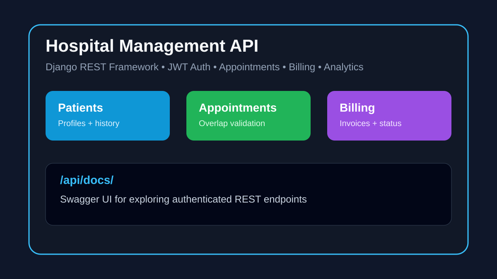

# Hospital Management System


A production-style hospital management backend built with Django REST Framework. It handles role-based users, doctors, patients, appointments, prescriptions, invoices, dashboard analytics, Dockerized services, and OpenAPI documentation.

## Screenshot / Preview



## Recruiter Highlights

- REST API architecture with Django REST Framework
- JWT authentication and role-based access control
- Real healthcare domain modeling: patients, doctors, appointments, billing, prescriptions
- Docker Compose setup with PostgreSQL and Redis
- OpenAPI/Swagger documentation for API exploration
- Testable backend structure with deployment-ready configuration

## Features

- Authentication with SimpleJWT
- Roles: `ADMIN`, `DOCTOR`, `PATIENT`
- Doctor and patient profile management
- Appointment booking with overlap validation
- Prescription and invoice modules
- Dashboard overview analytics with Redis cache
- Swagger UI and OpenAPI JSON schema
- Native SQLite mode for quick local setup
- Docker mode for PostgreSQL + Redis environment
- Render deployment blueprint

## Tech Stack

| Layer | Tools |
| --- | --- |
| Backend | Django, Django REST Framework |
| Auth | SimpleJWT |
| Database | SQLite for native dev, PostgreSQL for Docker/prod |
| Cache | Redis, django-redis |
| API Docs | drf-spectacular, Swagger UI |
| Deployment | Gunicorn, Whitenoise, Docker, Render |

## Getting Started

### Option 1: Native Quick Start

Use this when Docker is not installed.

```bash
git clone https://github.com/lokananda9/Hospital-Management-System.git
cd Hospital-Management-System
scripts\run_native.cmd
```

App URL:

```text
http://127.0.0.1:8000/
```

Swagger docs:

```text
http://127.0.0.1:8000/api/docs/
```

### Option 2: Docker Quick Start

```bash
git clone https://github.com/lokananda9/Hospital-Management-System.git
cd Hospital-Management-System
scripts\run_docker.cmd
```

Docker mode uses PostgreSQL and Redis from `docker-compose.yml`.

## Manual Setup

```bash
python -m venv .venv
.venv\Scripts\activate
pip install -r requirements.txt
copy .env.native.example .env
python manage.py migrate
python manage.py runserver 127.0.0.1:8000
```

## Run Tests

```bash
.venv\Scripts\python.exe manage.py test
```

## Key API Endpoints

| Method | Endpoint | Purpose |
| --- | --- | --- |
| POST | `/api/v1/auth/login/` | Login |
| POST | `/api/v1/auth/refresh/` | Refresh JWT |
| GET | `/api/v1/auth/me/` | Current user |
| GET/POST | `/api/v1/users/` | User management |
| GET/POST | `/api/v1/doctors/` | Doctor records |
| GET/POST | `/api/v1/appointments/` | Appointment workflow |
| GET/POST | `/api/v1/prescriptions/` | Prescriptions |
| GET/POST | `/api/v1/invoices/` | Billing |
| GET | `/api/v1/dashboard/overview/` | Analytics overview |

## Project Structure

```text
accounts/        authentication and user roles
appointments/    appointment booking workflow
billing/         invoice and payment status logic
doctors/         doctor profiles
patients/        patient profiles
prescriptions/   prescriptions and medicines
analytics/       dashboard overview data
config/          Django settings and deployment config
scripts/         preflight, native, and Docker helpers
```

## Deployment Notes

- Render blueprint: `render.yaml`
- Production settings module: `config.prod`
- Use PostgreSQL and Redis in production
- Keep secrets in environment variables, not committed files

## Future Improvements

- Add GitHub Actions CI
- Add frontend dashboard
- Add seed demo screenshots from a running environment
- Expand API integration tests
